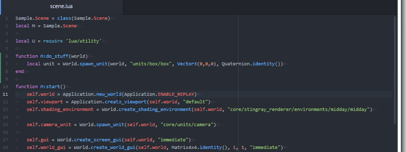
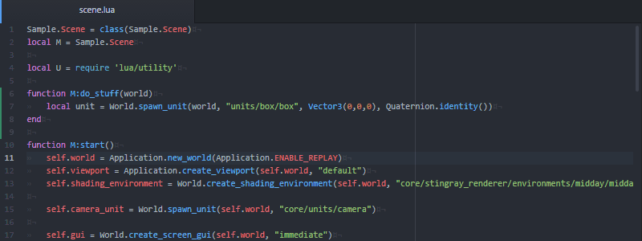

# Atom package for Stingray

This package provides a number of features that integrates Atom
with the Stingray game engine.

The following features are provided:

* SJSON syntax highlighting.
* Stingray Lua API help.
* Auto-complete for Lua API and resource paths.
* Navigate between resources
* Launch stingray project and hot reload content
* Lua REPL console integrated into Atom

Most of these features are available through the *Stingray* menu
added by the package.

## SJSON Syntax Highlighting

Stingray uses a "more human readable" format of JSON called SJSON.
The Stingray package provides SJSON syntax highlighting for
Stingray resource files, such as `.level`, `.unit`, etc.

The syntax package also provides HLSL syntax high lighting for
resource shaders, using the shader syntax from [sublime-shaders](https://github.com/noct/sublime-shaders).

## Stingray Lua API Help

Press `F1` to bring up the Adoc help for the Stingray Lua API
function located under your cursor.

Press `Shift-F1` to bring up a dialog box that allows you to search among all the help files.

