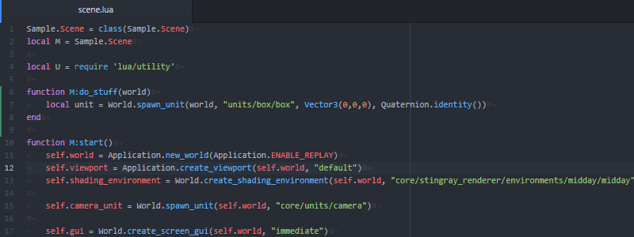

# Atom package for Stingray

This package provides a number of features that integrates Atom
with the Stingray game engine.

The following features are provided:

* SJSON syntax highlighting.
* Stingray Lua API help.
* Auto-complete for Lua API and resource paths.
* Navigate between resources
* Launch stingray project and hot reload content
* Lua REPL console integrated into Atom

Most of these features are available through the *Stingray* menu
added by the package.

## SJSON Syntax Highlighting

Stingray uses a "more human readable" format of JSON called SJSON.
The Stingray package provides SJSON syntax highlighting for
Stingray resource files, such as `.level`, `.unit`, etc.

The syntax package also provides HLSL syntax high lighting for
resource shaders, using the shader syntax from [sublime-shaders](https://github.com/noct/sublime-shaders).

## Stingray Lua API Help

Press `F1` to bring up the Adoc help for the Stingray Lua API
function located under your cursor.

Press `Shift-F1` to bring up a dialog box that allows you to search among all the help files.

## Auto-complete for Lua API and Stingray resource paths

As you type Lua API functions and Stingray resource path, the Stingray
plugin will offer autocomplete suggestions.

## Navigate between resources

With the cursor in a Stingray resource path you can quick-jump to the
resource.

## Launch stingray projects and hot-reload content

You can launch Stingray projects directly from atom by choosing
`Run Project`. Atom will locate your current project by reading
the settings file in your toolchain folder (located by the `$SR_BIN_DIR`
variable).

If you just want to check that your data compiles without actually
launching the project, you can use the `Compile` menu
option.

With the project running there are several ways of hot-reloading
project content. `Refresh` tells the engine to reload all changed files.

If you are just working in Lua, you can use `Execute Buffer` to
run the Lua file you are currently editing. This will effective hot-reload
that file. You can also use `Execute Selection` to run just the
Lua coe that you have currently selected.

## Lua REPL console integrated into Atom

`Toggle Console` shows the Lua REPL that allows you to communicate
with the running Lua engine. Output from the engine will be printed
to the console and you can write Lua code directly into the console.
